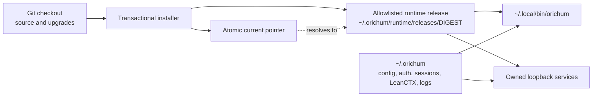
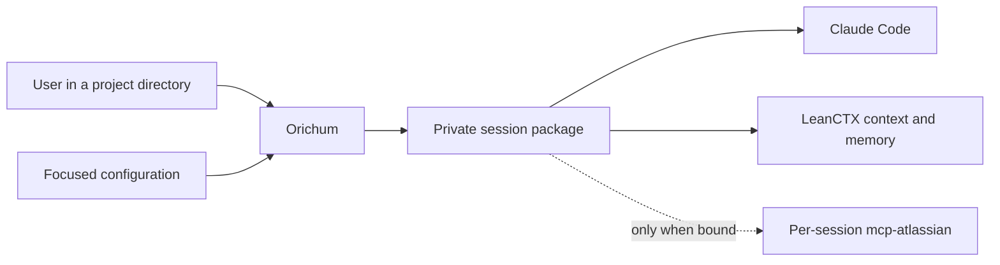
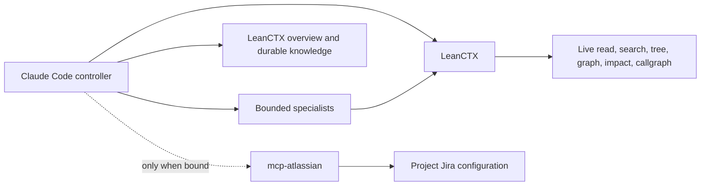
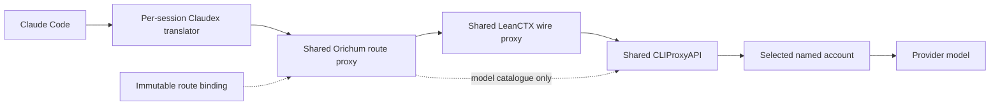

# Architecture

## Installed control plane

The repository is an installation source, not the live runtime. The installer
copies only the declared runtime payload into a content-addressed real
directory, verifies its manifest, and switches the current pointer atomically.
The launcher and resident services bind to that physical release. User-edited
configuration, credentials, session state, and LeanCTX knowledge stay outside
the release under the same `ORICHUM_HOME`, so an upgrade never replaces them.

## Session creation

Orichum resolves the launch directory, selects the configured stack and named
account, then materializes one private physical session. The session contains
immutable route state, a strict MCP file, the controller plugin, and a
project-jailed LeanCTX configuration.

## Context path

LeanCTX is the only code-context and durable-memory engine. Source indexes and
graphs are built lazily. Shared project data survives sessions, while each
physical session has private configuration, state, event, and cache
directories. No generated graph is written into a repository and no global
LeanCTX hook or daemon is installed.

Specialists reuse the same session MCP for bounded repository context, while
the controller alone calls overview and durable knowledge. This keeps worker
reads compressed without duplicating Orichum's orchestration or allowing
concurrent memory writes.

`mcp-atlassian` is started only when the resolved project declares direct Jira
credentials or `.orichum/config.json` selects a private named profile. The
process loads the selected private URL, username, and token at startup. The
session MCP file contains only the project root and optional profile alias.

## Launch sequence

1. Resolve the configured containing project context.
2. Discover and strictly validate the nearest optional `.orichum/config.json`
   within that context, with legacy model-only `models.json` compatibility.
3. Resolve its service account names against private Jira profiles and existing
   GitHub authentication; explicit `null` disables a service.
4. Validate machine configuration and discover live provider/model routes.
5. Select eligible provider accounts and build the repository model mapping as
   an in-memory stack.
6. Freeze the logical model route and the physical project's service selectors
   and integrity digest.
7. Materialize the controller plugin, strict MCP file, private LeanCTX contract,
   and optional external-tool identities.
8. Start and health-check the session's Claudex translator.
9. Launch Claude Code.

Resume revalidates services and creates a fresh physical package while
preserving the logical session route. Fork creates a new logical binding and
carries only a bounded handoff.

## Model request path

The route proxy selects the session's frozen primary route or one compatible
fallback before LeanCTX compresses the model request. The shared LeanCTX proxy
then optimizes the growing system prompt, conversation history, and tool
results while preserving live prompt-cache prefixes. Model-catalogue discovery
bypasses LeanCTX because its local `/v1/models` endpoint is not an upstream
catalogue; all inference traffic follows the solid path above.

The route proxy also keeps the deterministic LeanCTX MCP surface resident on
verified request protocols and defers unrelated optional schemas. The MCP and
wire proxy are two complementary planes: one reduces tool output before it
enters the conversation, while the other reduces the accumulated request sent
on later turns.

## Deterministic tool routing

| Need | Tool |
|---|---|
| Task orientation and prior project context | `ctx_overview` |
| Durable decisions, conventions, outcomes, or gotchas | `ctx_knowledge` |
| Read, search, tree, or exact expansion | LeanCTX |
| Relationships, symbols, call paths, or change impact | LeanCTX graph tools |
| Anchored supported text edit | `ctx_patch` |
| Any finite, non-interactive shell command | `ctx_shell` |
| Finite command requiring exact output | `ctx_shell(raw=true)` |
| Interactive, streaming, long-running, LeanCTX-rejected, or unsupported command | Native `Bash` on demand |
| Unsupported or binary file operation | Native file tools |
| Jira reads and writes | Project-bound `mcp-atlassian` |

The controller does not choose routes by enumerating CLIs or providers.
`ctx_shell` is the resident finite-command lane; native `Bash` is deferred and
loaded only for process control, a LeanCTX rejection, or unsupported shell
behavior. Orichum disables LeanCTX's executable-name allowlist only inside the
private session MCP, so installed, custom, and future CLIs use the same lane
without per-command configuration. LeanCTX's dangerous-pattern blocking,
project jail, and secret redaction remain active. Orichum does not replay a
command through both paths unless one bounded raw follow-up is needed.
`ctx_patch`, `ctx_shell`, and external-service mutations retain Claude Code's
normal approval behavior.

## Boundaries

- Network services listen on loopback only.
- CLIProxyAPI, LeanCTX, and the Orichum route proxy are shared services; each
  active session has only its own Claudex translator and immutable state.
- Session files and account registries are private and digest-bound.
- Each Atlassian process belongs to one physical session and one project
  configuration; projects without Jira credentials pay no process or schema
  cost.
- LeanCTX shared data contains repo-aware graph and knowledge state; session
  configuration, events, and cache remain isolated.
- The controller is the sole writer; specialist agents follow the configured
  bounded policy.
- The route proxy performs at most one safe pre-output fallback.

Orichum integrates upstream projects without modifying their source code.
